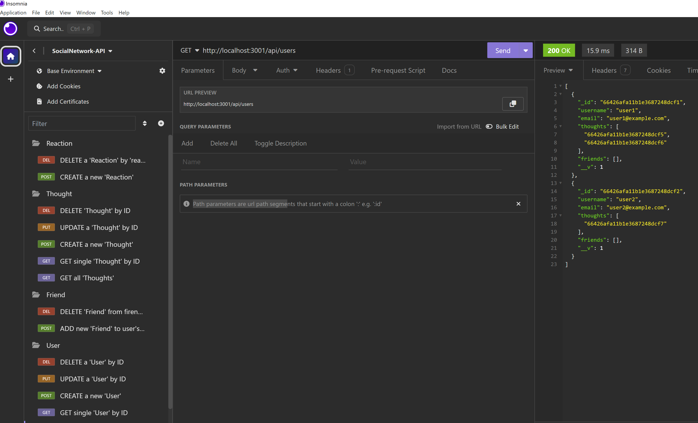
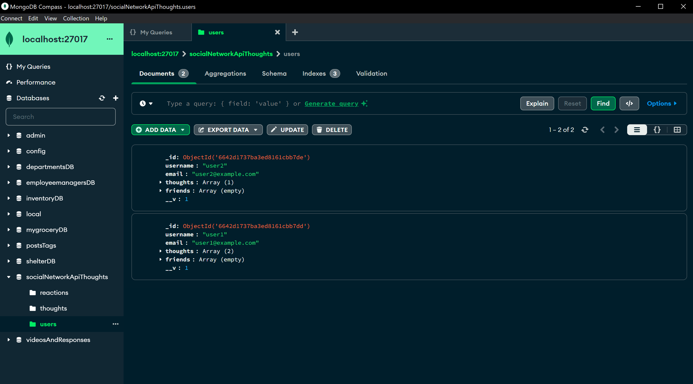

# SocialNetwork-API
## Description
This application was created to manage the "DataBase" of a supposed Social Network 'type' application, it was achived by mainly using **'express'** and **'mongoose'**. by doing this, we can manage and see the DB inside *'MongoDB compass'*, and the format of models and route is easier and different from other programs.

The DB contains 'Users', and they are able to make 'Thoughts'; other users are able to react to other "Toughts' and write what they think of it.

The only thing missing to make this a 'fullstack' application, would be to add a layout and the front-end, so that all the *'end-points'* are used properly and so that the normal user can see how this works.

## How to use the Project
To run the project, first we need to open the Integrated Terminal, and run 'npm run seed', after this, the DB will be completely seeded, and now we are able to run 'npm start', to host the application locally.

When this is done, the application will be running in the localhost, and now we are able to open **'Insomnia'**, and use the diferent endpoints to interact with the database and use teh CRUD operations.

We are also able to see the database by opening *'MongoDB compass'*, once the application is running.

---
### Example of running application:

---

### Personal info :
- GitHub repository of the project :
- Video example of the implementation of operations :
